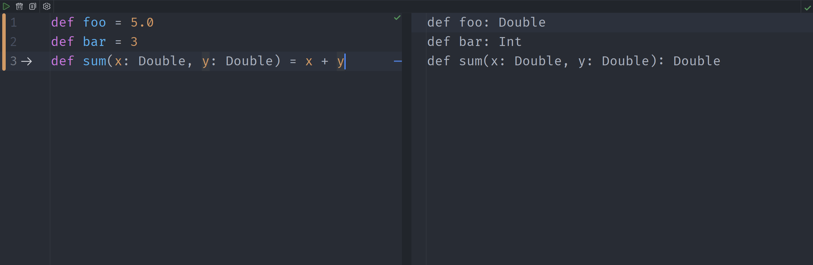

---
title: "Assignment 1 -- Introduction"
author: "Dr P.-A. Mudry"
version: "v1.0.00"
course: "205.1 Functional Programming"
toc-title: "Table of contents"
summary: 
--- 

<!-- summary: |          
      <div style="text-align:center" width="100%"></div> -->

<style>  
r { color: Red } 
y { color: Yellow } 
FIXME { color: Yellow }
TODO {color: Black; background-color: Yellow}
</style>

# Exercise 1 -- Starting slowly and installing tools (difficulty :star:)
In this first assignment, you will start by exploring the various tools at your disposal for developing functional programs. You will also be able to check that your tools have been installed correctly. In the second part of the assignment, you will apply some of the knowledge you got during the first lesson in a practical exercise.

::::: Success :::::::::::::::::::::::::::::::::::::::::
**Installation** --- Verify that you have a working version of _IntelliJ_ with a proper `Scala 2.13` installed. For this first assignment, we will focus on the usage of _worksheets_. Reminder : worksheets are similar to the REPL, except that you have access to multiple commands at the same time. 
:::::::::::::::::::::::::::::::::::::::::::::::::::::::

With the tools installed, you can configure your IDE so that evaluation takes place every time you modify the file or that you press a key combination. The result of the evaluation is then displayed on the right-hand side of the screen (as depicted below):

<!-- filewatcher exam.md 'pandoc exam.md -o exam.html -f markdown+emoji --template=Github.html5 --toc --toc-depth=2 --data-dir=. --embed-resources --standalone' -->
 
<div style="text-align:center" width="80%"></div>

Note that the evaluation window directly displays the return type and value of the expression on the left. If required, you can force the evaluation of the worksheet by pressing the keys <kbd>Ctrl</kbd> + <kbd>Alt</kbd> + <kbd>W</kbd> together. 

1. Add a new worksheet called `FirstSteps.sc` to the project.
1. In the worksheet, define a function that returns the square of a value. Check that your function works correctly by applying various values to it.
1. Define another function that returns the 4$^{th}$ power of a value, using the `square` function you just defined.
1. As you can see, the worksheet always returns the type that has been inferred for the expression you type or from the evaluation. What do you expect the worksheet to return for the following definition?

    ```scala
    def bar(x: Int, y: Boolean) = "Hello"
    ```

<!-- bar: (x: Int, y: Boolean)String -->

# Exercise 2 -- Getting our hands dirty (difficulty :star:) 

::::: Warning :::::::::::::::::::::::::::::::::::::::::
**How to be efficient in the series** --- There is always a method to find a solution on the Internet, using ChatGPT or looking at the solution. However, you **NEED** to work by yourself and find your own path to the knowledge. This is the way.
:::::::::::::::::::::::::::::::::::::::::::::::::::::::

You are now asked to write a function to compute the square root of a number\footnote{This exercise is originally from the SICP}. Its prototype should be as follows:

```scala
def sqrt(x: Double) : Double
```

## Task 1 -- Newton's method
A typical numerical method to compute the zeroes (or roots) of a function is the Newton's method. Given a function $f$ and its derivative $f'$, we begin with a guess $x_0$ for the root. A better approximation $x_1$ of the root is then given by :

$$x_1 = x_0 - \frac{f(x_0)}{f'(x_0)}$$

The process is then repeated with the recursion equation:

$$x_{n+1} = x_n - \frac{f(x_n)}{f'(x_n)}$$

and stopped when the residual $\epsilon$ is small enough.

## Task 2 -- Application to the square root function

Let's say one wishes to compute^[Example from <http://en.wikipedia.org/wiki/Newton's_method>] $\sqrt{612}$. This is equivalent to $x^2 = 612$. The function to use in Newton's method is then $f(x) = x^2 - 612$. Its derivative is $f'(x) = 2x$. With an initial approximation of 10 (you can choose what you want here), the steps are then :

$$
\begin{aligned}
x_1 &= x_0 - \frac{f(x_0)}{f'(x_0)} = 10 - \frac{10^2 - 612}{2\cdot10} = 35.6\\
x_2 &= x_1 - \frac{f(x_1)}{f'(x_1)} = 35.6 - \frac{35.6^2 - 612}{2 \cdot 35.6} = 26.3955\ldots\\
\vdots\\
x_5 &= 24.73863375\ldots
\end{aligned}
$$


## Task 3 -- Implementation
As you can see, with only five steps the solution is already accurate to more than five decimal places (all the decimals written are correct). With the help of recursion, you now have to implement this method for computing square roots.

1. Create a new worksheet in _IntelliJ_ to write your code for this assignment.

1. Define a function `isGoodEnough` that determines if your solution is good enough. You solution can be considered good enough for example when $\epsilon < 0.0001$. To compute the value of $\epsilon$ you can simply consider the error made by your function in the approximation. For this part, you need to compute an absolute value function.

1. Define another function, called `improve`, to compute the value of $x_{n+1}$, given the current approximated value and the value of x.

1. Using the previously defined functions, define the `sqrt` method. Please note that you can add other functions if you need to!

1. Test your method and check your results.

1. [_Optional_] Implement the cubic root using the same approach and check your results.

# Exercise 2 -- Getting our hands dirty (difficulty :star:) 

::::: Warning :::::::::::::::::::::::::::::::::::::::::
**How to be efficient in the series** --- There is always a method to find a solution on the Internet, using ChatGPT or looking at the solution. However, you **NEED** to work by yourself and find your own path to the knowledge. This is the way.
:::::::::::::::::::::::::::::::::::::::::::::::::::::::

You are now asked to write a function to compute the square root of a number\footnote{This exercise is originally from the SICP}. Its prototype should be as follows:

```scala
def sqrt(x: Double) : Double
```

## Task 1 -- Newton's method
A typical numerical method to compute the zeroes (or roots) of a function is the Newton's method. Given a function $f$ and its derivative $f'$, we begin with a guess $x_0$ for the root. A better approximation $x_1$ of the root is then given by :

$$x_1 = x_0 - \frac{f(x_0)}{f'(x_0)}$$

The process is then repeated with the recursion equation:

$$x_{n+1} = x_n - \frac{f(x_n)}{f'(x_n)}$$

and stopped when the residual $\epsilon$ is small enough.

## Task 2 -- Application to the square root function

Let's say one wishes to compute^[Example from <http://en.wikipedia.org/wiki/Newton's_method>] $\sqrt{612}$. This is equivalent to $x^2 = 612$. The function to use in Newton's method is then $f(x) = x^2 - 612$. Its derivative is $f'(x) = 2x$. With an initial approximation of 10 (you can choose what you want here), the steps are then :

$$
\begin{aligned}
x_1 &= x_0 - \frac{f(x_0)}{f'(x_0)} = 10 - \frac{10^2 - 612}{2\cdot10} = 35.6\\
x_2 &= x_1 - \frac{f(x_1)}{f'(x_1)} = 35.6 - \frac{35.6^2 - 612}{2 \cdot 35.6} = 26.3955\ldots\\
\vdots\\
x_5 &= 24.73863375\ldots
\end{aligned}
$$


## Task 3 -- Implementation
As you can see, with only five steps the solution is already accurate to more than five decimal places (all the decimals written are correct). With the help of recursion, you now have to implement this method for computing square roots.

1. Create a new worksheet in _IntelliJ_ to write your code for this assignment.

1. Define a function `isGoodEnough` that determines if your solution is good enough. You solution can be considered good enough for example when $\epsilon < 0.0001$. To compute the value of $\epsilon$ you can simply consider the error made by your function in the approximation. For this part, you need to compute an absolute value function.

1. Define another function, called `improve`, to compute the value of $x_{n+1}$, given the current approximated value and the value of x.

1. Using the previously defined functions, define the `sqrt` method. Please note that you can add other functions if you need to!

1. Test your method and check your results.

1. [_Optional_] Implement the cubic root using the same approach and check your results.